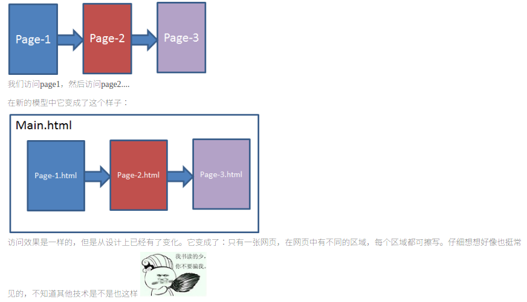

###了解前端路由,并且学习angularjs的路由(ui-router)

>这是一个两天任务

####这是个啥？
ui-router是一个web客户端的路由解决方案。我觉得它最大的作用是将web界面的设计分块了。
####分块分层
最初的web访问模型，是这样的：


###代码实现

#####原理讲完再简述一下实现吧
1. 下载js文件，引入到index.html文件中。

2. 在html中，添加注入位置: <div ui-view="">它是当被触发注入时，填充的位置。

3. 在html中，添加触发器：<ANY ui-sref="XXX">。XXX是$state，它遵循xxx.xxx的树形结构，渲染时从根节点开始渲染。

4. 在app.js中，配置路由函数 .config(function($stateProvider, $urlRouterProvider) {});

>细说一下：

引入代码
没啥要细说的，要说就是路径别写错吧 。
注入位置

**对于多个分栏的结构，可以使用多个view的实现，然后反过来在config中使用bbb@AAA的声明指定本state中子view对应的模板，例如：**
```javascript
$stateProvider
    .state('index', {
        url: '/index',
        views: {
            '': {
                templateUrl: 'tpls/index.html'
            },
            'main1@index': {
                templateUrl: 'tpls/form1.html'
            },
             'main2@index': {
                templateUrl: 'tpls/form2.html'
            }
        }
    })

//in html
<div class="container">
    <div ui-view="main1"></div>
    <div ui-view="main2"></div>
</div>

```
这个代码中将form1.html 和 form2.html 填充到了对应的的view中。

####添加触发器

如果在标签中添加了 ui-sref="xxx"，未激活状态时，它是看不到的。具体描述可以看下官网. 通常我们都是激活状态，但有时总想自己控制一下。可以参考：

```javascript
<ul>
  <li ui-sref-active="active" class="item">
    <a href ui-sref="app.user({user: 'fansy'})">@fansy</a>
  </li>
</ul>

```
当user是fansy时，显示后面那行字。这个例子是官方的，我是没用明白这个功能，回头在研究吧。

####配置路由

**首先是 $urlRouterProvider**

它通常用来配置非 $state 的额外的路由.例如：

`$urlRouterProvider.when("","/home");  `

将默认页设置为/home的URL。注意哦，这里用的是URL，别写错成state了。

当然也可以写一个任何额外页面的定向：

`$urlRouterProvider.otherwise("/home");  `

这样访问其他阿猫阿狗的页面，就都跑到/home那去了。

然后是 $stateProvider

触发点是按层级来的，它遵守的路由规则可以从官网的，这个页面 中找到。通过 $state.go 函数可以将状态位置强行切换，我们可以在任何一处写下面的js代码：

`$state.go('home.state1');  `

另外，你也可以在$stateProvider 中对应的state里面配置controller，当这种state被激活，就会调用对应的函数了，例如：

```javascript

$stateProvider
    .state("home",{
        url:"/home",
        templateUrl:"tmpls/home.html",
        controller:function($scope,$state) {
            console.log("enter home");
        }
    })

```
每当状态变为home时，都输出一条日志。

最后，渲染是按层级来的。因此改变同级节点并不会重新渲染父节点。并且不改变状态就不会重新渲染。比如一直按同一个按钮，就不会重新渲染；没更改跟节点，点一个"刷新"按钮，也不会刷新整个页面。

最后

其他详细可以看它的[主页](https://github.com/angular-ui/ui-router) ，另外有一篇 [好文章](http://www.oschina.net/translate/angularjs-ui-router-nested-routes?print) 也值得借鉴.